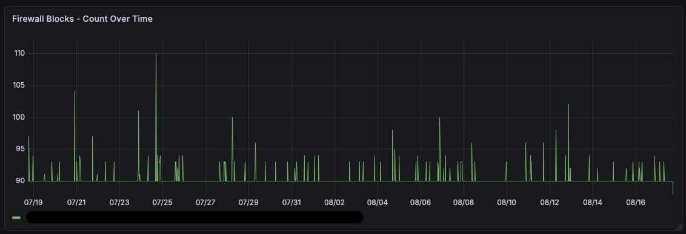
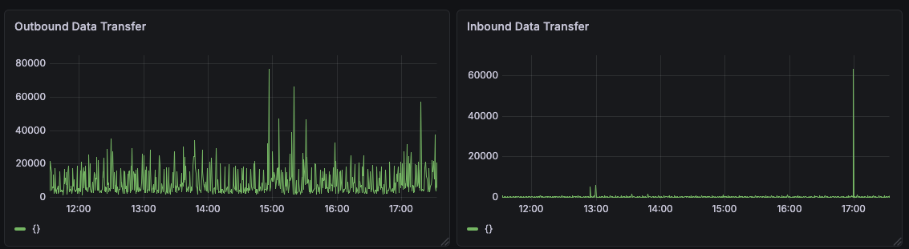
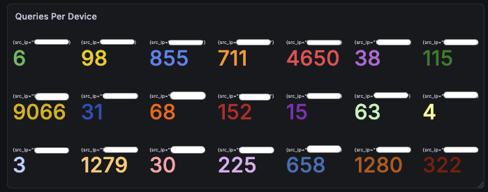
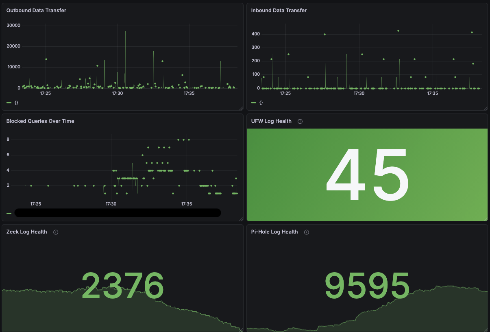

## Phase 3 — Detection Engineering & Dashboards 

#### **Status: Complete (Dashboards & Config Management) | Ongoing (Baseline Establishment)**
---
## Overview

Phase 3 focused on moving from passive log collection to active visibility, building a centralized logging pipeline and a suite of Grafana dashboards that provide real-time monitoring across my home network's key security data sources.

My goal was to build something I understand end-to-end: where the data comes from, how it flows, what it means, and when something looks wrong.

---
## Infrastructure Built

### Centralized Logging Pipeline

| Component | Role | Location |
|-----------|------|----------|
| Zeek | Network traffic capture (JSON format) | 2012 Mac Mini (dedicated) |
| Promtail | Log shipping agent | 2012 Mini, 2014 Mini, Raspberry Pi |
| Loki | Log aggregation and storage | 2014 Mac Mini |
| Grafana | Visualization and querying | 2014 Mac Mini |

All components run as Docker containers except Promtail on the Raspberry Pi, which runs as a lightweight systemd binary service. This was a deliberate choice to minimize resource overhead on a device already running Pi-hole.

### Log Sources

| Source | Job Label | What It Captures |
|--------|-----------|-----------------:|
| UFW firewall | `ufw` | Blocked/allowed connections |
| Zeek conn.log | `zeek` | All network flows, bytes, duration, connection state |
| Zeek dns.log | `zeek` | DNS queries and responses |
| Zeek ssl/http/ssh/weird | `zeek` | Protocol-specific traffic detail |
| Pi-hole | `pihole` | DNS queries and gravity blocked domains |
| Pi-hole FTL | `pihole-ftl` | Pi-hole engine health |
| Frigate | `frigate` | Camera detection events (collected, dashboard deferred - see below) |

---
## Dashboards Built

### Dashboard 1 - Firewall Overview

**Purpose:** Primary visibility into what's being blocked at the network perimeter.

**Panels:**
- UFW blocks over time (time series) - establishes baseline block volume and surfaces spikes
- Top internal source IPs - bar gauge showing which internal devices generate the most blocked traffic
- Top external source IPs - bar gauge for inbound block sources
- Top destination ports - identifies which ports are most frequently probed (using `topk` to manage cardinality)
- Raw firewall log stream - full log lines for event-level investigation

**Key decision:** Internal and external source IPs were split into separate panels rather than combined. The reasoning: internal IPs generating blocks represent a different threat category (compromised devices, misconfigured services) than external probing and warrant separate prioritization during triage.

**Key challenge:** UFW logs are unstructured syslog format, requiring pattern parsing to extract fields like `SRC` (source IP address) and `DPT` (destination port). This added complexity compared to JSON-native sources and informed the decision to switch Zeek to JSON output early in the process.

---
### Dashboard 2 - Zeek Network Traffic

**Purpose:** Visibility into allowed network traffic and what's actually happening on the network beyond what's being blocked. This is where post-compromise activity would appear.

**Panels:**
- Outbound data transfer over time (`orig_ip_bytes`) - baseline for normal egress volume; spikes indicate potential exfiltration
- Inbound data transfer over time (`resp_ip_bytes`) - baseline for normal ingress; large transfers may indicate unauthorized downloads
- Outbound connections log (internal to external) - filtered log stream of connections leaving the network, formatted to show source, destination, duration, bytes, and protocol
- Inbound connections log (external to internal) - same for inbound connections
- Raw conn.log stream - full connection records for deep investigation
- Raw dns.log stream - DNS query/response log for domain-level correlation
- Raw weird.log stream - Zeek's native anomaly log for protocol-level irregularities

**Key decision:** Connection duration was considered as a ranked metric panel but ultimately kept as a raw log stream. The reasoning: sorting by duration in a home network environment would consistently surface expected long-lived connections (camera feeds, media streaming, remote work tools) rather than genuine anomalies. A ranked "top duration" panel would create noise rather than signal until a proper baseline is established and known-good connections can be filtered.

**Key decision:** Zeek was switched from default TSV (tab-separated values) format to JSON output during this phase. While this meant discarding historical TSV logs, the decision was ultimately better as JSON enables cleaner `| json` field extraction in LogQL without fragile pattern parsing, and the tradeoff was acceptable since the project was still in baseline-establishment mode.

**Note on network visibility:** Zeek currently captures traffic to/from the dedicated monitoring machine only. Full network visibility requires port mirroring from the managed switch. This is a planned next step pending switch configuration access.

---

### Dashboard 3 - DNS Monitoring

**Purpose:** DNS-layer visibility into what the network is trying to reach, and what's being blocked.

**Panels:**
- Blocked queries over time - volume of Pi-hole gravity blocks; spikes may indicate malware C2 attempts or unusual device behavior
- Queries per device - DNS query count by source IP; a sudden spike from a single device is a potential indicator of beaconing or compromise
- Raw blocked query log - live stream of gravity-blocked domains for investigation

**Key decision:** I spent significant time evaluating a "top queried domains" panel before deciding against it as a primary panel. The issue was threefold: high cardinality (hundreds of unique domains across even short time ranges), the maintenance burden of a "known good" exclusion list, and the security risk of relying on that list in the first place. Techniques like domain fronting, where malicious traffic hides behind trusted domains, mean that filtering by "known good" can create a false sense of coverage and blind spots in monitoring.

The more important insight: Pi-hole has a purpose-built GUI that handles top queried and blocked domains well. Rather than duplicating that functionality in Grafana with significant tradeoffs, the dashboard was scoped to what Grafana uniquely adds: time-series correlation with other dashboards and per-device behavioral visibility.

---
### Dashboard 4 - Combined Security Overview

**Purpose:** At-a-glance daily health check.

**Panels:**
- UFW blocks over time
- Pi-hole blocked queries over time
- Outbound data transfer over time
- Inbound data transfer over time
- Queries per device
- Log source health stats (UFW, Zeek, Pi-hole) - count of log entries received in the last 15 minutes; drops to zero indicate a broken pipeline

**Design philosophy:** Every panel on this dashboard was chosen because it surfaces anomalies without requiring correlation with another panel. Panels that needed context from other data sources to be meaningful were kept on their respective dashboards instead.

---
## Frigate / Camera Monitoring - Deferred

Frigate logs are being collected and are available in Loki, but I deferred the Frigate dashboard for the following reasons:

1. Camera count is currently limited (single doorbell camera via Reolink/Frigate integration)
2. The Reolink app provides sufficient camera-specific monitoring at current scale
3. A meaningful Frigate security dashboard becomes more valuable with multiple cameras across distinct zones

This will be revisited as part of a future camera expansion phase.

---
## Config Version Control

All configuration files are committed to this repository for reproducibility:

- Docker Compose files for Loki, Grafana, and Promtail (2014 Mini)
- Docker Compose files for Zeek and Promtail (2012 Mini)
- Promtail binary config (Raspberry Pi)
- Zeek local.zeek configuration (JSON logging enabled)
- Grafana dashboard JSON exports

This ensures the full monitoring stack can be reconstructed from scratch if needed and provides a change history for configuration decisions.

---
## What I Learned

***LogQL has meaningful constraints that shape dashboard design.*** Unlike SQL, LogQL requires a time range component on all metric queries. This means "count by field" queries always produce time series rather than simple aggregates, which creates bucketing artifacts that can inflate counts. Working around this required understanding query types (Range vs. Instant), using `$__range` for single-bucket aggregation, and in some cases accepting visualization tradeoffs rather than forcing the wrong data shape into the wrong panel type.

***Tool selection should follow use case, not completeness.*** The Pi-hole dashboard decision was the clearest example of this: building a full replica of the Pi-hole GUI in Grafana would have required significant effort and produced a worse result. Scoping the dashboard to what Grafana uniquely enables (cross-source time correlation and alerting) produced a more useful outcome.

***Baselines come before detection.*** The dashboards are complete, but meaningful anomaly detection requires weeks of normal operation data. The current phase is observation, learning what "normal" looks like for this specific network before writing alert thresholds or detection rules.

---
## Next Steps (Phase 4)

- **Detection logic in LogQL** - alert rules for port scan signatures, DNS beaconing patterns, unusual outbound connection volume
- **Grafana alerting** - notification pipeline for threshold breaches
- **Promtail to Grafana Alloy migration** - Promtail is deprecated; migration planned once baseline is established
- **Port mirroring** - full network visibility via managed switch SPAN port configuration
- **Frigate expansion** - additional cameras and dedicated monitoring dashboard
